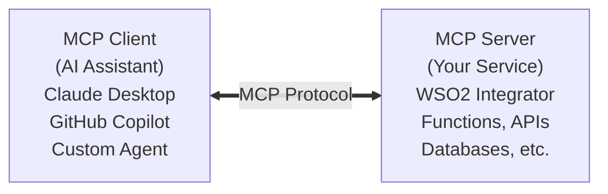

# What is MCP?

The Model Context Protocol (MCP) is an open standard that defines how AI assistants discover and interact with external tools, data sources, and services. Think of MCP as a universal adapter between AI and enterprise systems.

Instead of building custom integrations for each AI assistant, you publish an MCP server once and any MCP-compatible client can use it.

## Why MCP?

Before MCP, connecting AI assistants to enterprise data required custom code for each client. MCP standardizes this with a single protocol:

- **Claude Desktop** can query your CRM
- **GitHub Copilot** can access your internal APIs
- **Custom AI Agents** can use community MCP servers for Slack, GitHub, and file systems

All through the same protocol, with no client-specific code.

## How MCP Works



1. **Discovery** -- The client connects and asks the server what tools, resources, and prompts are available
2. **Invocation** -- The client calls a tool or reads a resource with structured parameters
3. **Response** -- The server executes the request and returns results
4. **Context** -- The AI assistant incorporates the results into its reasoning

## MCP Capabilities

MCP defines three types of capabilities:

| Capability | Description | Direction |
|------------|-------------|-----------|
| **Tools** | Functions the AI can call with parameters and receive results | AI calls your code |
| **Resources** | Read-only data the AI can access for context | AI reads your data |
| **Prompts** | Pre-defined prompt templates the AI can use | AI uses your templates |

## MCP in WSO2 Integrator

WSO2 Integrator supports MCP in two directions.

### As an MCP Server

Expose your integrations as tools that AI assistants can discover and call. Use the `ballerina/mcp` module and attach an `mcp:Service` to an `mcp:Listener`. Each `remote function` on the service becomes an MCP tool automatically -- the tool description and parameter descriptions are taken from the Ballerina doc comment.

```ballerina
import ballerina/mcp;

listener mcp:Listener mcpListener = new (9090);

service mcp:Service /mcp on mcpListener {

    # Look up the status of a customer order by order ID.
    #
    # + orderId - The unique order identifier
    # + return - The current status of the order
    remote function getOrderStatus(string orderId) returns json|error {
        return check orderApi->get(string `/orders/${orderId}/status`);
    }
}
```

### As an MCP Client

Consume tools from an external MCP server inside an AI Agent. The `ai:McpToolKit` connects to a remote MCP endpoint and exposes all of its tools to the AI Agent.

```ballerina
import ballerina/ai;

final ai:McpToolKit weatherMcp = check new ("http://localhost:9090/mcp");

final ai:Agent myAgent = check new (
    systemPrompt = {
        role: "Weather Assistant",
        instructions: string `You help users check the weather.`
    },
    tools = [weatherMcp],
    model = check ai:getDefaultModelProvider()
);
```

## Transport Options

| Transport | Use Case |
|-----------|----------|
| **stdio** | Local MCP clients like Claude Desktop |
| **Streamable HTTP** | Remote or web-based clients, modern HTTP with streaming support |

## What's Next

- [What is RAG?](what-is-rag.md) -- Retrieval-augmented generation concepts
- [Creating an MCP Server](/docs/genai/develop/mcp/creating-mcp-server) -- Build your own MCP server
- [Building AI Agents with MCP Servers](/docs/genai/develop/mcp/agents-with-mcp) -- Consume MCP tools in AI Agents
