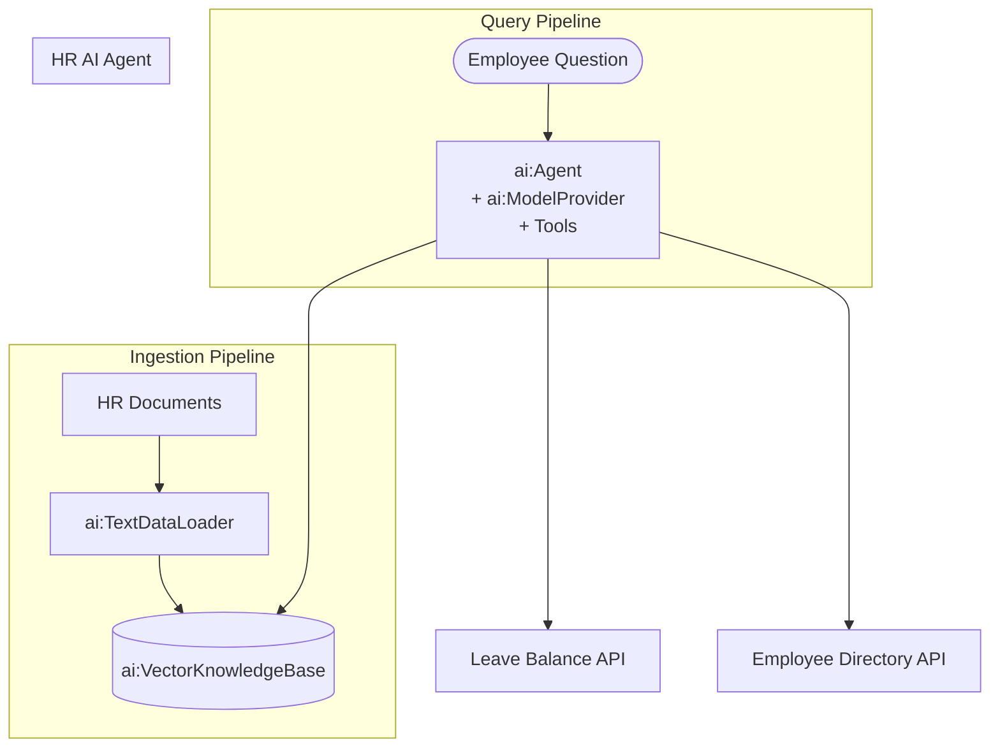

# Building an HR Knowledge Base Agent with RAG

**Time:** 45 minutes | **Level:** Intermediate | **What you'll build:** An HR knowledge base AI Agent that answers employee questions about company policies, benefits, and procedures by retrieving relevant context from ingested HR documents using RAG.

In this tutorial, you build an end-to-end HR knowledge base AI Agent powered by retrieval-augmented generation. The agent ingests HR policy documents into a vector knowledge base, retrieves relevant sections when employees ask questions, and generates accurate answers grounded in your actual policies. This ensures employees get consistent, up-to-date answers rather than responses based on generic LLM training data.

You will use the canonical `ballerina/ai` module — which ships with the WSO2 Integrator distribution — for the model provider, embeddings, vector store, and AI Agent.

## Prerequisites

- [WSO2 Integrator VS Code extension installed](/docs/get-started/install)
- A default model provider configured via the VS Code command **"Configure default WSO2 Model Provider"**, OR an OpenAI API key if you prefer to bring your own
- A sample set of HR policy documents (PDF or text) to ingest

## Architecture



## Step 1: Create the Project

Create a new WSO2 Integrator project. The `ballerina/ai` module is bundled with the distribution, so you do not need a separate dependency block for it.

```toml
# Ballerina.toml
[package]
org = "myorg"
name = "hr_knowledge_base_agent"
version = "0.1.0"
distribution = "2201.13.0"
```

The only explicit dependency you might add is for an external connector such as `ballerinax/ai.openai` (if you want to use OpenAI directly) or `ballerina/http` (for the HR API client). Those are pulled automatically when imported.

## Step 2: Set Up Configuration

If you are using the WSO2 default model provider, run the VS Code command **"Configure default WSO2 Model Provider"** and it will add a `[ballerina.ai]` block to `Config.toml` for you. Otherwise, add an OpenAI key:

```toml
# Config.toml
openAiApiKey = "<your-openai-api-key>"
hrApiUrl = "http://localhost:8080/api/hr"
```

```ballerina
// config.bal
configurable string openAiApiKey = ?;
configurable string hrApiUrl = ?;
```

## Step 3: Define Data Types

```ballerina
// types.bal
type LeaveBalance record {|
    string employeeId;
    string employeeName;
    int annualLeave;
    int sickLeave;
    int personalLeave;
    int carryOver;
|};

type EmployeeInfo record {|
    string employeeId;
    string name;
    string department;
    string manager;
    string email;
    string startDate;
|};

type LeaveRequestInput record {|
    string employeeId;
    string leaveType;
    string startDate;
    string endDate;
    string reason;
|};
```

## Step 4: Build the Knowledge Base

The `ballerina/ai` module provides everything you need for RAG: an in-memory vector store, a text data loader, and a vector knowledge base. For production, you can swap in an external vector store such as Pinecone, Weaviate, Milvus, or pgvector by importing the corresponding `ballerinax/ai.*` connector.

```ballerina
// knowledge_base.bal
import ballerina/ai;

final ai:VectorStore vectorStore = check new ai:InMemoryVectorStore();
final ai:EmbeddingProvider embeddingProvider = check ai:getDefaultEmbeddingProvider();
final ai:KnowledgeBase knowledgeBase =
        new ai:VectorKnowledgeBase(vectorStore, embeddingProvider);
final ai:ModelProvider modelProvider = check ai:getDefaultModelProvider();

# Load an HR policy document from disk and ingest it into the knowledge base.
#
# + filePath - Absolute or workspace-relative path to the document
# + return - `()` on success, or an error if the file cannot be loaded or ingested
public function ingestPolicyDocument(string filePath) returns error? {
    ai:DataLoader loader = check new ai:TextDataLoader(filePath);
    ai:Document|ai:Document[] docs = check loader.load();
    check knowledgeBase.ingest(docs);
}
```

:::tip Swap in a production vector store
To use Pinecone instead of the in-memory store, change two lines:

```ballerina
import ballerinax/ai.pinecone;

configurable string pineconeServiceUrl = ?;
configurable string pineconeApiKey = ?;

final ai:VectorStore vectorStore =
        check new pinecone:VectorStore(pineconeServiceUrl, pineconeApiKey);
```
The rest of the code does not change — `ai:VectorKnowledgeBase` works with any `ai:VectorStore`.
:::

## Step 5: Define Agent Tools

The agent needs four tools: one that searches the knowledge base (this is the RAG-in-a-tool pattern), and three that talk to the HR backend. Each tool is an `isolated` function annotated with `@ai:AgentTool`. Descriptions come from doc comments — there is no `@ai:Param` annotation.

```ballerina
// tools.bal
import ballerina/ai;
import ballerina/http;

final http:Client hrApi = check new (hrApiUrl);

# Search the HR knowledge base for policies, benefits, and procedures.
# Use this for any question about leave policies, benefits, code of conduct,
# or onboarding. Returns an answer grounded in the company's HR documents.
#
# + question - The employee's HR question
# + return - A natural-language answer grounded in retrieved policy chunks
@ai:AgentTool
isolated function searchHrKnowledgeBase(string question) returns string|error {
    ai:QueryMatch[] matches = check knowledgeBase.retrieve(question, 5);
    ai:Chunk[] context = from ai:QueryMatch m in matches select m.chunk;
    ai:ChatUserMessage augmented = ai:augmentUserQuery(context, question);
    ai:ChatAssistantMessage answer = check modelProvider->chat(augmented);
    return answer.content ?: "No answer could be generated from the knowledge base.";
}

# Retrieve the current leave balance for an employee.
# Use this when an employee asks how many leave days they have remaining.
#
# + employeeId - Employee ID in the format `EMP-XXXXX`
# + return - The employee's leave balance, or an error if not found
@ai:AgentTool
isolated function getLeaveBalance(string employeeId) returns LeaveBalance|error {
    return hrApi->get(string `/leave-balance/${employeeId}`);
}

# Look up an employee by name or ID.
# Returns department, manager, and contact details.
#
# + query - Employee name or employee ID
# + return - Employee information
@ai:AgentTool
isolated function lookupEmployee(string query) returns EmployeeInfo|error {
    return hrApi->get(string `/employees?search=${query}`);
}

# Submit a leave request on behalf of an employee.
# Use this only when the employee has explicitly confirmed all leave details.
#
# + request - The leave request payload
# + return - The created leave request response
@ai:AgentTool
isolated function submitLeaveRequest(LeaveRequestInput request) returns json|error {
    return hrApi->post("/leave-requests", request);
}
```

:::info The RAG-in-a-tool pattern
The `searchHrKnowledgeBase` tool is the canonical way to combine RAG with an AI Agent. Inside the tool, you `retrieve` relevant chunks, call `ai:augmentUserQuery` to build a grounded user message, and then ask the model to answer. The agent decides *when* to call this tool based on its doc comment.
:::

## Step 6: Create the AI Agent

```ballerina
// agent.bal
import ballerina/ai;

final ai:Agent hrAgent = check new (
    systemPrompt = {
        role: "HR Knowledge Base Assistant",
        instructions: string `You are an HR Knowledge Base Assistant for the company.

Role:
- Help employees find answers to HR-related questions about policies, benefits, leave, and procedures.
- Provide accurate information grounded in the company's actual HR documents.

Tool usage:
- ALWAYS call searchHrKnowledgeBase for questions about policies, benefits, or procedures. Never guess.
- Call getLeaveBalance to check remaining leave days.
- Call lookupEmployee to find employee details, managers, or contact information.
- Call submitLeaveRequest only when the employee has confirmed all leave details.

Guidelines:
- Cite the source when referencing a specific policy.
- If the answer is not in the knowledge base, clearly state that and suggest contacting HR directly.
- Be professional, empathetic, and concise.
- For sensitive topics (termination, disciplinary actions, salary), advise the employee to speak with their HR representative.
- Never disclose another employee's personal information, leave balance, or salary.`
    },
    tools = [searchHrKnowledgeBase, getLeaveBalance, lookupEmployee, submitLeaveRequest],
    model = modelProvider
);
```

## Step 7: Expose as a Chat Service

Use `ai:Listener` to get built-in session memory and the standard `ai:ChatReqMessage` / `ai:ChatRespMessage` payloads. The `sessionId` from each request is what drives per-user conversation history.

```ballerina
// service.bal
import ballerina/ai;

service /hr on new ai:Listener(8090) {

    # Chat endpoint for employee HR questions.
    #
    # + request - The incoming chat request with a session ID and user message
    # + return - The agent's response, or an error
    resource function post chat(ai:ChatReqMessage request)
            returns ai:ChatRespMessage|error {
        string response = check hrAgent.run(request.message, request.sessionId);
        return {message: response};
    }
}
```

You can add a separate plain HTTP service for document ingestion if you want to trigger it over the network; for this tutorial we expose a simple function and call it from `main`.

```ballerina
// main.bal
import ballerina/io;

public function main() returns error? {
    // Ingest a few HR documents on startup.
    check ingestPolicyDocument("./docs/leave-policy.pdf");
    check ingestPolicyDocument("./docs/benefits-guide.pdf");
    check ingestPolicyDocument("./docs/code-of-conduct.pdf");

    io:println("HR knowledge base ingestion complete. Chat service ready on :8090.");
}
```

## Step 8: Run and Test

1. Start the service:
   ```bash
   bal run
   ```

2. Ask HR questions. The request body matches `ai:ChatReqMessage`:
   ```bash
   curl -X POST http://localhost:8090/hr/chat \
     -H "Content-Type: application/json" \
     -d '{"sessionId": "emp-10042", "message": "How many annual leave days do I get per year?"}'
   ```

3. Continue the conversation using the same `sessionId` — the `ai:Listener` keeps conversation state in process:
   ```bash
   curl -X POST http://localhost:8090/hr/chat \
     -H "Content-Type: application/json" \
     -d '{"sessionId": "emp-10042", "message": "And what about sick leave?"}'
   ```

4. Ask a question that triggers a backend tool call:
   ```bash
   curl -X POST http://localhost:8090/hr/chat \
     -H "Content-Type: application/json" \
     -d '{"sessionId": "emp-10042", "message": "How many sick days does EMP-10042 have left?"}'
   ```

## What You Built

You now have an HR knowledge base AI Agent that:
- Ingests HR policy documents into an `ai:VectorKnowledgeBase` using the default embedding provider
- Retrieves relevant policy sections using semantic search wrapped as an agent tool
- Generates accurate, grounded answers using `ai:augmentUserQuery`
- Checks employee leave balances and submits leave requests through a plain HTTP client
- Maintains conversation context across turns via `ai:Listener`
- Protects sensitive employee information through its system prompt

## What's Next

- [RAG Knowledge Base](rag-knowledge-base.md) — Explore advanced RAG techniques
- [Chunking & Embedding](/docs/genai/rag/chunking-embedding) — Tune chunking strategies for policy documents
- [Memory Configuration](/docs/genai/agents/memory-configuration) — Configure persistent memory for long conversations
- [AI Governance and Security](/docs/genai/reference/ai-governance) — Add governance and audit logging
